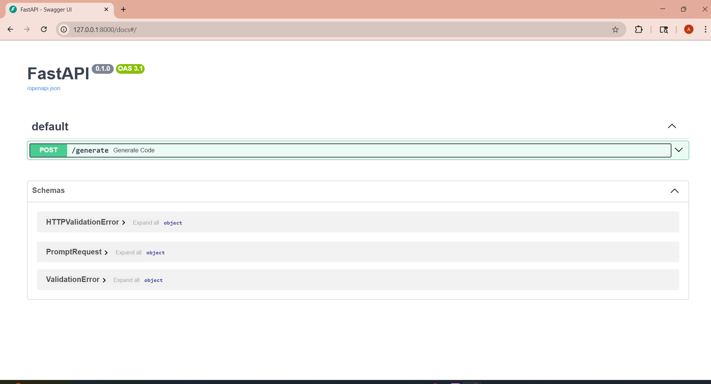
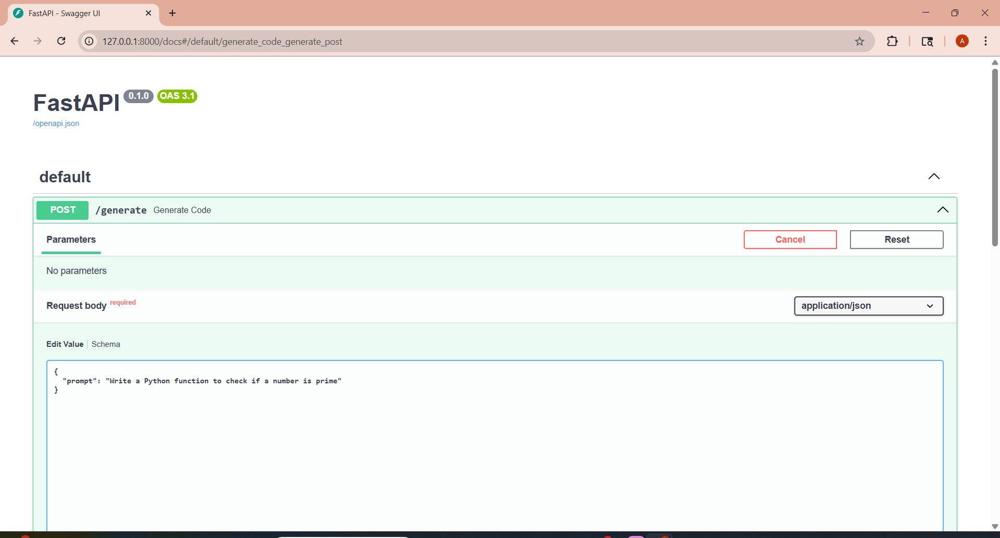
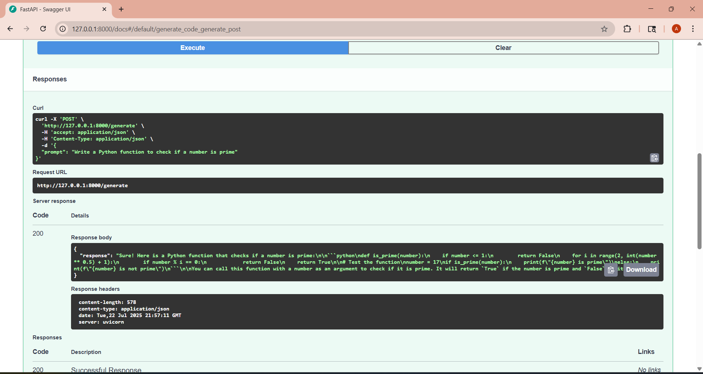
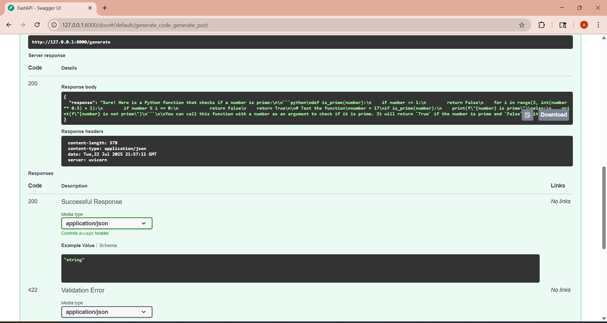
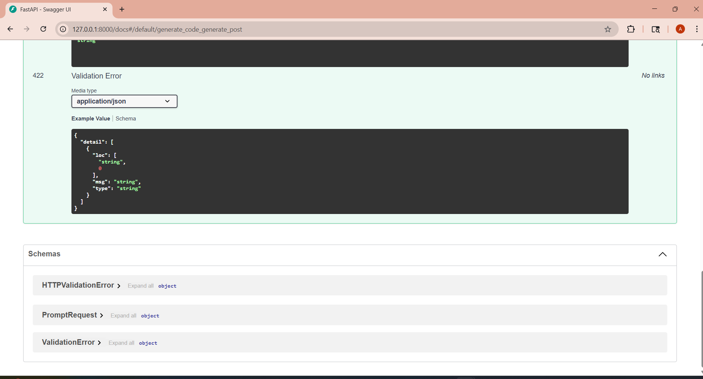
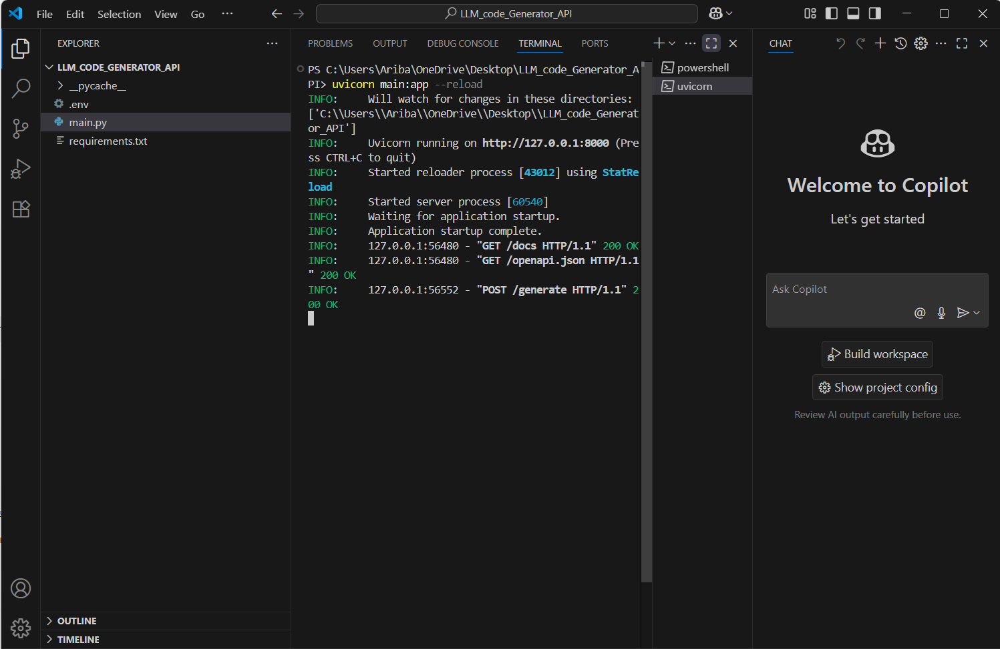
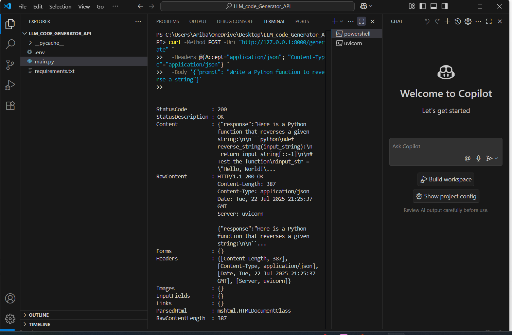

# 🧠 LLM Code Generator API

A simple yet powerful FastAPI-based backend that takes natural language prompts and returns AI-generated Python code using OpenAI's GPT model.

---

## 🚀 Tech Stack

- **Python 3.10+**
- **FastAPI**
- **Pydantic**
- **OpenAI API (gpt-3.5-turbo)**
- **dotenv**

---

## ✨ Features

- Accepts code-related prompts via an HTTP POST request
- Returns Python code generated by an LLM
- Clean, modular backend code using FastAPI
- Easy to extend with frontend or authentication

---

## 📁 Project Structure

LLM_code_Generator_API/
├── main.py             # FastAPI backend with OpenAI integration
├── .env.example        # Sample .env file (DO NOT share real keys)
├── requirements.txt    # Project dependencies
├── .gitignore          # Hides sensitive files like .env
└── screenshots/        # Folder containing numbered screenshots

---

## ⚙️ Setup Instructions

1. Clone the repository
 git clone https://github.com/Ariba-Sameen-Ansari/llm-code-generator-api.git
cd llm-code-generator-api

2. (Optional) Create a virtual environment
 python -m venv venv
#For Windows
venv\Scripts\activate
#For macOS/Linux
source venv/bin/activate

3. Install dependencies
   pip install -r requirements.txt

4. Add your OpenAI API key
Create a .env file in the root directory and add:
OPENAI_API_KEY=sk-xxxxxxxxxxxxxxxxxxxxxxxxxxxxxxxxxxxx

5. Run the FastAPI server
uvicorn main:app --reload


## 🧪 Test the API (Example Request)
Via curl:
curl -X 'POST' \
  'http://127.0.0.1:8000/generate' \
  -H 'accept: application/json' \
  -H 'Content-Type: application/json' \
  -d '{"prompt": "Write a Python function to reverse a string"}'


## 🔍 Sample Response
{
  "response": "Here's a Python function that reverses a string:\n\n```python\ndef reverse_string(s):\n    return s[::-1]\n```"
}


## 🖼️ Screenshots

All screenshots of successful local testing are stored in the `/screenshots` folder and embedded below:

✅ Project running on localhost  


✅ Prompt request sent using curl  


✅ JSON response received from the API  


✅ Visual confirmation in browser/Postman  


✅ PowerShell environment commands  


✅ GitHub repo structure  


✅ .env key hidden and .gitignore added  



## 📄 License
This project is licensed under the Apache 2.0 License.


